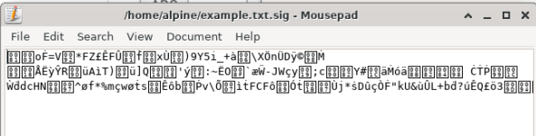
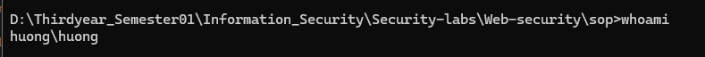

# Task 1: Transfer files between computers

**Question 1**:
Conduct transfering a single plaintext file between 2 computers,
Using openssl to implementing measures manually to ensure file integerity and authenticity at sending side,
then veryfing at receiving side.

**Answer 1**:

## 1. Conduct transfering a single plaintext file between 2 computers :

_First create public key_

```sh
openssl rsa -pubout -in private_key.pem -out public_key.pem
```

_Secondly create private key_

```sh
openssl genpkey -algorithm RSA -out private_key.pem -pkeyopt rsa_keygen_bits:2048
```

_Thirdly, I write a message and save it in a text file:_<br>

```sh
echo "This is a secure message from Alpine Linux." > example.txt
```


_Next, create digital signature:_<br>

```sh
openssl dgst -sha256 -sign private_key.pem -out example.txt.sig example.txt
```



## 2. Transfer file

_Check information of reciever machine:_<br>




_Transfer file from virtual machine Alpine Linux to my Windows_

```sh
scp example.txt example.txt.sig public_key.pem huong@172.23.160.1:"/C/Users/huong/OneDrive/Documents"
```

_After transfering successfully, check if i have enough "example.txt, example.txt.sig, public_key.pem"_

## Comfirm digial signature

```sh
openssl dgst -sha256 -verify public_key.pem -signature example.txt.sig example.txt
```

_If it's valid, the screen will show "Verified OK"_

# Task 2: Transfering encrypted file and decrypt it with hybrid encryption.

**Question 1**:
Conduct transfering a file (deliberately choosen by you) between 2 computers.
The file is symmetrically encrypted/decrypted by exchanging secret key which is encrypted using RSA.
All steps are made manually with openssl at the terminal of each computer.

**Answer 1**:

# Task 3: Firewall configuration

**Question 1**:
From VMs of previous tasks, install iptables and configure one of the 2 VMs as a web and ssh server. Demonstrate your ability to block/unblock http, icmp, ssh requests from the other host.

**Answer 1**:
